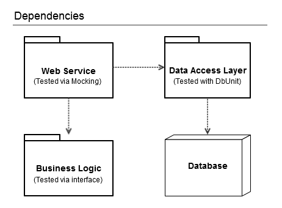
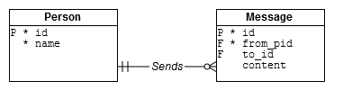

## DbUnit Example ##

The goal of this project is to provide an example of how and where to use [DbUnit](http://dbunit.sourceforge.net/) in conjunction with an in-memory [H2 database](http://www.h2database.com/).

### Background ###

There are many important things to keep in mind when testing code that "lives near" the database.  I will highlight a few concerns here, and recommend reading some excellent notes by Jens Schauder, copied at the bottom of this page.  An in-memory database instance is commonly used as a substitute for a more burly or full-featured database (like PostgreSQL or Oracle) when testing.  The combination of DbUnit and H2 makes assumptions about certain testing philosophies, mainly stemming from the fact that we don't live in a perfect world.  Ideally, tests should be run against the same database vendor that will be in use with the production application.  However, this would require every developer, tester, and continuous integration engine to have a dedicated database, which is rarely possible.  For this reason (and with an interest in faster-running test suites) projects often concede to using a stand-in database (like H2) for testing.  Given that there is some element of risk with the DbUnit/H2 combination, it should only used when needed.  Consider the following dependency diagram.

Most applications are built in such a way as to isolate code that "touches" the database from the rest of the application.  This layer between the database and the rest of the application is usually known as the Database Access Layer (DAL).  Its purpose, of course, is to minimize/isolate the changes required when the database schema is modified and/or the database vendor is changed.  As it turns out, the DAL abstraction also serves to delineate where DbUnit should be employed – at least when using a "pseudo" database for testing.  As mentioned in the notes at the bottom of this page, the rest of the application can simply "inject" the DAL as a dependency, thereby allowing for testing without the need for a database (and without the need for DbUnit).  The different methods referenced in the above diagram are used in the example application below.

### Example Cork Board Application ###

I created a simple web application to serve as an example for where to employ different kinds of testing.  The application acts as a rudimentary "bulletin board", where people can post messages written to everyone else or to a specific person.  It uses the JBoss RestEasy framework to expose a few web services, and for persistence it uses an oracle database.  Here are the table descriptions:

For example, here's how to create a new person-record for "Ted", and another for "Tito":

    
    $ echo '{"name":"Ted"}' | curl -X POST --header 'Content-Type: application/json' \
      --data-binary @- http://localhost:8080/cork/person/addOrUpdate
    !!com.example.dto.Person {id: 1, name: Ted}
    $ echo '{"name":"Tito"}' | curl -X POST --header 'Content-Type: application/json' \
      --data-binary @- http://localhost:8080/cork/person/addOrUpdate
    !!com.example.dto.Person {id: 2, name: Tito}

The service returns the Person record, serialized as JSON.  Notice that, upon return, the record has an ID.  We can now post a few messages:

    $ echo '{"fromPersonId":1, "toPersonId":2, "content":"Hello Tito!"}' | \
      curl -X POST --header 'Content-Type: application/json' --data-binary @- http://localhost:8080/cork/message/add
    !!com.example.dto.Message {content: Hello Tito!, fromPersonId: 1, id: 1, toPersonId: 2}
    $ echo '{"fromPersonId":2, "toPersonId":1, "content":"Hello Ted!"}' | \
      curl -X POST --header 'Content-Type: application/json' --data-binary @- http://localhost:8080/cork/message/add
    !!com.example.dto.Message {content: Hello Ted!, fromPersonId: 2, id: 2, toPersonId: 1}
    $ echo '{"fromPersonId":1, "content":"Hello everyone!"}' | \
      curl -X POST --header 'Content-Type: application/json' --data-binary @- http://localhost:8080/cork/message/add
    !!com.example.dto.Message {content: Hello everyone!, fromPersonId: 1, id: 3, toPersonId: null}

At this point, here are the contents of the database tables:

    SQL> select * from person;
         ID NAME
          1 Ted
          2 Tito
    SQL> select * from message;
         ID   FROM_PID     TO_PID CONTENT
          1          1          2 Hello Tito!
          2          2          1 Hello Ted!
          3          1            Hello everyone!
    SQL>  

Note that a toPersonId of "null" indicates a message broadcast to everyone.  Therefore, if we want to see the messages for Ted to read, there should be two:

    $ curl --header 'Content-Type: text/plain' http://localhost:8080/cork/message/getTo/2
    - !!com.example.dto.Message {content: Hello Tito!, fromPersonId: 1, id: 1, toPersonId: 2}
    - !!com.example.dto.Message {content: Hello everyone!, fromPersonId: 1, id: 3, toPersonId: null}

Finally, by way of feigning a semblance of business logic, we can find the md5 hash of all the messages sent by a given person:

    $ curl --header 'Content-Type: text/plain' http://localhost:8080/cork/message/md5/sentFrom/1
    bef3db06bd701d45303a57cde38a4079

The goal of this sample application was to have a basic example of each of the components shown in the dependency diagram above.  That is, some web services (com.example.rest), some business logic (com.example.biz), and a DAL (com.example.dal).  All the code is available in this github repo.

### Testing the Application ###

#### Business Logic ####

The most straightforward test is that for the com.example.biz.Digester class.  The point here is simply to keep the business logic decoupled from the services that employ it.  For example, the com.example.rest.MessageService class does not create the hash.  Rather, it delegates to com.example.biz.  This allows for an easy "test surface".

    @Test
    public void testMd5() {
       List<Message> ml = new ArrayList<Message>();
       Message m = new Message();
       m.setContent("make me a sandwich.");
       ml.add(m);
       m = new Message();
       m.setContent("sudo make me a sandwich.");
       ml.add(m);
       Assert.assertEquals("55afdd56f6cc7e6e4f13312eaae9f7dc",
      new Digester().md5(ml));
    }

#### Data Access Layer ####

This section and the one following are the focus of this entire project.  It just took some context to get here.  Thanks for hanging in there.  Alright, so, we want to test the DAL code, but we don't want to require a full-up oracle beast to be ready and waiting whenever we need it.  Here are two keys for testing DAL code with a light-weight substitute:

- Ensure that the DAL code provides for injection of a DataSource object
- Ensure that the test database is has an in-memory mode

The second bullet is optional, but using a database that does not run in-memory is likely to defeat the purpose of using a substitute database.  The first point is required.  Well, more accurately, you just need some sort of "connection provider" interface, which appears to be the spirit behind javax.sql.DataSource.  Hibernate repositories allow for injection of a DataSource and therefore meet this first requirement.  In my example web application, the MessageKeeper class handles the persistence of Message objects in the database.  The MessageKeeperTest class exercises the code in the MessageKeeper class without requiring the oracle database to be online.  Take a look at [MessageKeeperTest.java](src/test/java/com/example/dal/MessageKeeperTest.java), for which we owe thanks to [Marc Phillip](http://www.marcphilipp.de/blog/2012/03/13/database-tests-with-dbunit-part-1/).

To walk through this, let's start at the testGetMessagesTo() method.  Its goal is to test the getMessagesTo(int personId) method of the MessageKeeper class.  The first line of this method (line 63) exemplifies dependency injection.  We use an alternate constructor of the MessageKeeper class that allows us to supply its DataSource.  To supply the DataSource, we call a private dataSource() method that returns a "connection provider" (aka DataSource) for an in-memory H2 database.  See the [H2 docs](http://www.h2database.com/html/features.html#in_memory_databases) for an explanation of the JDBC_URL.  On line 64 we call mk.getMessagesTo(2) and expect to receive a set with two messages.  This is because we created the schema and loaded our test database with test data before this test even began, via the @BeforeClass and @Before annotations.  These are discussed next.

Line 38 employs a DbUnit utility that runs the "h2.sql" file against the H2 database engine, thereby generating the schema (i.e. creating the two tables, "person" and "message").  This highlights the risk mentioned in the background section above.  The h2.sql file builds the tables in the H2 database, but the "build.sql" file, elsewhere in the source tree (see above) is responsible for building the tables in the oracle database.  They are not the same.  This is the risk.  This is also the impetus for Schauder's suggestion (below) regarding "database independent SQL".  If you avoid using vendor-specific features and oddities, then you are less likely to run into problems changing database engines or using a stand-in test database.  Ideally, "build.sql" and "h2.sql" would simply be compile-time-generated "views" of a generic model stored in some vendor-neutral DDL.  Maybe something like this exists; I don't know.

The loadTestData() method uses the "set1.xml" file, shown in the source tree above.  This is the test data that we expect to be present in the H2 instance when the testGetMessagesTo() method begins.  Since in-memory databases are very fast, we can and probably should do this before every test.  Again, this is one of Scheauder's point below about making sure your tests "clean up after themselves".  He suggests either using a rollback after the test or recreating the schema before every test.  However it's done, we want to ensure that the database is in a known state before a test is run – the main purpose of the DbUnit framework.

#### Web Services ####

DbUnit is not needed by all unit tests that read from a database.  In fact, as mentioned in the Background section, it is safest to use DbUnit exclusively with DAL code.  When testing code that *uses* DAL code, you can simply mock the DAL, as exemplified in the following code.  I have mixed reviews of the mockito framework, but it is well-written and widely-used.  Take a look at [MessageServiceTest.java](src/test/java/com/example/rest/MessageServiceTest.java).

### Conclusion ###

Three different testing methodologies are used for the main components of the example application.  It can be reliability tested without the need for a dedicated oracle instance:

    Running com.example.rest.MessageServiceTest
    Tests run: 1, Failures: 0, Errors: 0, Skipped: 0, Time elapsed: 2.297 sec
    Running com.example.dal.MessageKeeperTest
    Tests run: 1, Failures: 0, Errors: 0, Skipped: 0, Time elapsed: 1.358 sec
    Running com.example.biz.DigesterTest
    Tests run: 1, Failures: 0, Errors: 0, Skipped: 0, Time elapsed: 0 sec
    
    Results :
    
    Tests run: 3, Failures: 0, Errors: 0, Skipped: 0
    
    [INFO] ------------------------------------------------------------------------
    [INFO] BUILD SUCCESS
    [INFO] ------------------------------------------------------------------------
    [INFO] Total time: 18.051 s
    [INFO] Finished at: 2014-09-16T10:10:21-04:00
    [INFO] Final Memory: 17M/60M
    [INFO] ------------------------------------------------------------------------

I again recommend reading Schauder's notes copied below, and [Marc Phillip's DbUnit tutorial](http://www.marcphilipp.de/blog/2012/03/13/database-tests-with-dbunit-part-1/).

----------

### Tips for Testing Database Code ###
Written by [Jens Schauder](http://blog.schauderhaft.de/2012/01/15/tipps-for-testing-database-code/), 15 Jan 2012 

Almost everybody understands that source code belongs into version control. Many people understand we need to test our code. Quite a few do that automatically.

But everything seems to change when it comes to databases. A lot of stuff in and around databases goes untested. Heck some of the scripts don’t even live in version control. If you can’t believe that, because you haven’t seen it, you are a damn lucky bastard.

At least one reason for this state of affairs is obviously: It hurts. Database tests tend to be slow, interdependent and hard to maintain. Granted. But you know what: If it hurts, you should do it more often. It will teach you what exactly the things are that cause pain when testing and eventually you’ll find approaches to make it less painful. Here are some ideas I found helpful when testing database related code:

- Give every developer her own database. This forces you to find a way to set up the database fast, easy and reliable. If your application lives in a single user/schema/namespace it is sufficient for each developer to have his own user/schema/namespace in a single database. For this to work though …
- … the application should be user/schema/namespace agnostic. It makes it much easier to create multiple instances one a single server.
- Let the application live in a single user/schema/namespace. If you have multiple interdependent namespaces (e.g. for modules) you’ll have a hard time making them agnostic of the names.
-  Have separate instances for CI, Demos, QA and so on. Actually ideally it should be trivial to create a fresh instance.
- Stay away from any tool that comes with its own repository. I have seen about a dozen of such tools and although some looked promising in the beginning, they all completely failed to integrate with other tools on the development side of things. Examples of such tools are tools for code generation from UML or ER models and ETL tools.

The previous points where about the setup of your database and infrastructure. Lets have a look at the code:

- Favor a proper Language (like Java, C, PHP …) over database specific languages like T-SQL or PL/SQL. If you are wondering why, make a comparison between your favorite DB language and your all purpose language. For which do you get the better IDE, Unit testing support, code analysis, code coverage and so on. Reconsider your main language if it doesn’t win in that comparison.
- Have a small layer that does all interaction with the database. Make sure no SQL or other database dependent code leaks out. Inject that layer as a dependency into anybody in need of it. This will allow you to test almost everything without worrying about the database. Only the tests for that integration layer actually needs a database for testing.
- Favor database independent SQL or a library abstracting away the differences of various databases. Back in the time people claimed they needed that in case they have to switch database vendors, which never happened. Now it does. See below.

The next points will deal with the actual tests:

- Consider an in-memory-database for testing. Many databases can run in an in-memory-mode. They are great for testing, because you can throw them away after the test, and they are way faster then any database writing to disk. This of course is only possible when you work with a database system that can run as a in-memory-database or if your code is database independent. Hence the previous point.
- If you can’t use your database as in memory database, consider putting it on a RAM disk. We got a huge performance gain for our tests with this approach. A solid state disk might be the next best thing although I’m not sure how it would react to the heavy load of continuous database tests.
- Make test failure messages so explicit that you don’t have to look into the database for analyzing test failures.
- Use code for setting up your test data. Make it nice and concise. If you need a row in a table without special requirements for its values you should be able to create that with a single trivial line of code, no matter how many foreign keys the table contains. I.e. you should have a little [DSL for your test data](http://blog.schauderhaft.de/2011/03/20/testing-databases-with-junit-and-hibernate-part-2-the-mother-of-all-things/). Doing it with plain code will enable all the refactoring power of your IDE for your tests. For load and performance tests other approaches like loading production data or large amounts of generated data might be suitable.
- Make sure your tests clean up after them selves. There are two approaches I found usable in most cases:
	- Recreate the schema for every test. This is slow but really safe.
	- Do a rollback after each test. This only works when there is no commit inside the test. The mean thing is: If a test tries to rollback, but fails because there was a commit inside the test some completely different test will fail. It can be a really frustrating task to find the bad test in such a case.

We covered the testing of  database related code inside your application. But there is another kind of code we need to deal with: Scripts for deploying your application (or upgrading it)

- The scripts that change your database schema from one version to the next are source code just like everything else. Therefore they belong under version control and should get tested continuously.
- The testing process is really simple: Create a database as it looks now. Apply your change scripts and verify it looks as desired.
- For verifying the resulting schema it is useful to have a script that creates your target database (or at least the schema) from scratch, so you compare it with the result of the test.
- For performance reasons you might want to test this with an empty database first.
- But don’t forget to run it on an instance with realistic data as well. Hint: adding a column to huge tables can take loooooong.

Happy testing everybody.
